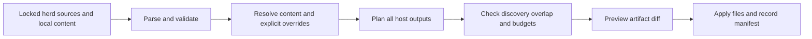

**Promptherder: native instruction and skill architecture**

Proposed design, researched September 8, 2026. Codex and Claude Code are the primary implementation and evaluation targets. The other five existing targets remain supported; no additional host targets are planned in this phase. The repository compiler is implemented for 1.0.0 on `feat/explicit-target-setup`. See the status below for the boundary between delivered file behavior and future runtime evaluation.

Promptherder should compile shared rules and skill bundles into each host's native loading mechanisms. Keep everyday instructions small, preserve activation semantics, and load procedures and reference material only when needed. Optimize for the host first; evaluate model-specific wording separately. Astra inside Codex and Astra inside another host do not necessarily receive the same files, tools, or instruction hierarchy.

**What the documentation establishes**

| Host/profile | Baseline and scoped rules | Native skill bundle location | Adapter consequence |
|---|---|---|---|
| Codex | `AGENTS.md`, directory-scoped instruction discovery | `.agents/skills/<name>/SKILL.md` | Keep skill bodies out of the project-document budget; arbitrary file globs need an explicit fallback. |
| Claude Code | `CLAUDE.md`; `.claude/rules/*.md` with `paths` | `.claude/skills/<name>/SKILL.md` | Preserve bundles and translate scoped rules; workflows can become manually invoked skills. |
| Copilot in VS Code | `.github/copilot-instructions.md`; `.github/instructions/*.instructions.md` with `applyTo`; also discovers `AGENTS.md` and `CLAUDE.md` | `.github/skills`, with other supported discovery roots | Treat VS Code, CLI, cloud agent, and code review as distinct capability profiles. |
| Cursor | `AGENTS.md` or `.cursor/rules/*.mdc` | `.agents/skills` or `.cursor/skills` | Fix the current `.md` output; preserve native activation metadata. |
| Windsurf/Cascade | `.windsurf/rules/*.md`; current redirected docs prefer `.devin/rules` | `.windsurf/skills/<name>/SKILL.md` | Pin a host profile; do not silently rename users' directories as branding and paths change. |
| Cline | `AGENTS.md`; `.clinerules/*.md` with `paths` | `.cline/skills` recommended; also discovers `.clinerules/skills` and `.claude/skills` | Account for cross-host discovery and global skill precedence. |
| Antigravity IDE | `.agents/rules/*.md`, with activation modes | `.agents/skills/<name>/SKILL.md` | Use skills for new workflows; maintain legacy export only for supported older versions. |

Sources: [Codex instructions](https://learn.chatgpt.com/docs/agent-configuration/agents-md), [Codex skills](https://learn.chatgpt.com/docs/build-skills), [Claude memory/rules](https://code.claude.com/docs/en/memory), [Claude skills](https://code.claude.com/docs/en/skills), [VS Code instructions](https://code.visualstudio.com/docs/agent-customization/custom-instructions), [VS Code skills](https://code.visualstudio.com/docs/agent-customization/agent-skills), [Copilot skills across surfaces](https://docs.github.com/en/copilot/how-tos/copilot-on-github/customize-copilot/customize-cloud-agent/add-skills), [Cursor rules](https://cursor.com/docs/rules), [Cursor skills](https://cursor.com/docs/skills), [Cascade rules](https://docs.devin.ai/desktop/cascade/memories), [Cascade skills](https://docs.devin.ai/desktop/cascade/skills), [Cline rules](https://docs.cline.bot/customization/cline-rules), [Cline skills](https://docs.cline.bot/customization/skills), [Antigravity rules](https://antigravity.google/docs/rules-workflows/), [Antigravity skills](https://antigravity.google/docs/skills/).

Two findings materially change the migration: Cursor documents that plain `.md` files in `.cursor/rules` are ignored, whereas the current exporter writes exactly that format. Antigravity documents retirement of workflows on November 1, 2026, with migration to skills. These are host integration changes, not model prompting changes. [Cursor format requirement](https://cursor.com/docs/rules), [Antigravity migration notice](https://www.antigravity.google/docs/migration/workflows-to-skills/).

**1. Preserve three kinds of content**

- Rules: short, enduring constraints, with explicit activation (`always`, `paths`, `manual`, or `relevance`). Mandatory baseline rules must not be converted into optional skills merely to save context.
- Skills: task procedures with names, precise descriptions, invocation policy, and complete supporting directories. A workflow is a skill intended as an entry point, not a second copy of the procedure.
- References: long API material, examples, review checklists, and templates loaded from a skill when needed. Resource size is not an invitation to load every resource at once.

Use the [Agent Skills specification](https://agentskills.io/specification) as the portable bundle format. Keep vendor-only metadata in adapter output or a namespaced sidecar. Validate the standard fields without pretending every host interprets extension fields identically.

Proposed herd shape:

```text
herd.json
rules/
  working-agreements.md
  shell.md
skills/
  compound-v-plan/
    SKILL.md
    references/plan-template.md
  compound-v-review/
    SKILL.md
    references/security.md
    references/performance.md
  tekmetric-api/
    SKILL.md
    references/Tekmetric-API.txt
  grugg-compress/
    SKILL.md
    scripts/...
overlays/
  codex/...
  claude/...
```

Keep existing `rules/`, `skills/`, `workflows/`, and uppercase skill variants readable during migration. Translate legacy metadata into the internal representation, issuing diagnostics for ambiguity. Do not force authors to convert all herds before the exporter improves.

Proposed rule metadata, owned by Promptherder rather than any vendor:

```yaml
---
id: oh.shell
activation: paths
paths: ["**/*.sh"]
required: true
---
Use the project's shell safety conventions.
```

Skill names remain ordinary standard-compliant names such as `compound-v-plan`. Put additional declarations in `herd.json`: logical ID, selected features, explicit dependencies, invocation policy, optional host overlays, and aliases. Keep `SKILL.md` useful outside Promptherder.

**2. Parse once; plan all targets before writing**



Introduce a small typed representation: `Rule`, `SkillBundle`, `Resource`, `InvocationPolicy`, `Origin`, and `HostCapabilities`. Use an actual YAML parser, retain supported semantics, and flag unknown instruction-bearing metadata. Alphabetical filenames provide determinism, not authority or a meaningful conflict policy.

Each adapter returns artifacts and diagnostics instead of mutating the filesystem. The global planner sees every output, including existing unmanaged files that hosts discover. Only after validation succeeds does a separate writer apply the plan. Dry-run and apply use the same plan. This also fixes the current design where dry-run herd merging does not materialize the new sources that downstream exporters read.

Suggested Go boundaries:

```text
internal/content/       parse, normalize, resolve, provenance
internal/targets/       capabilities and host renderers
internal/plan/          artifacts, discovery overlap, budgets, diagnostics
internal/install/       guarded writes, journal, stale-file cleanup
internal/app/           CLI orchestration
```

Replace `SimpleConcatTarget` incrementally. Retain the existing atomic file writer; replace direct target `Install` calls with `Plan` plus a centralized `Apply`. Build only the fields needed by current herds and the first adapters, rather than a general agent runtime.

**3. Treat activation and discovery as semantics**

Native glob rules should stay native where available. A glob such as `**/*.sh` cannot be represented exactly by a directory `AGENTS.md`: new files and mixed-language directories make that approximation unreliable. For Codex, emit a compact conditional instruction pointing to the rule document and label it `model-mediated`, or fail strict compilation when the source requires exact native activation. Directory-scoped instructions are appropriate only for genuinely directory-scoped content, with launch-directory discovery tested.

Manual invocation also varies. Claude, Cursor, and VS Code document `disable-model-invocation`; this must not be presumed portable to every host. Resolve a workflow to a native manual skill or command when verified. Otherwise offer a clearly labeled prompt-mediated entry point, with a strict-mode error if manual-only loading is required. A description saying “only when requested” is guidance, not an enforced tool permission.

Use namespaced commands such as `compound-v-plan` to avoid collisions with built-in `/plan` or `/review`. Short aliases are optional adapter features. Generate the help text with actual host invocation syntax; a Markdown heading must never be reported as an installed slash command.

**4. Plan for agents that read each other's files**

Writing one independent output tree per target is insufficient. Copilot can discover Claude skills; Cline can discover Claude skills; Codex, Cursor, and Antigravity discover `.agents/skills`. Several also consume `AGENTS.md`. This is a visibility problem, not simply a filename collision.

Maintain a discovery matrix per supported host profile. For each logical skill or rule, compute which generated and existing artifacts that host will see. Prefer one shared portable artifact when the enabled hosts can all consume it. Use native copies where necessary for coverage, but do not claim those copies are free of duplicate loading without testing the host's precedence rules.

Shared `.agents/skills` must contain portable bundles. Never place an Antigravity-only replacement there and assume Codex will ignore it. Do not rely on conflicting files with the same skill name being merged or overridden consistently. If incompatible variants cannot be isolated using documented discovery controls, fail the combined plan and recommend a separate host-specific checkout/profile. Namespacing distinguishes artifacts but does not prevent unwanted discovery.

Apply the same principle to baseline rules: prefer shared `AGENTS.md` where supported, with small native adapters for hosts needing other entry points. Avoid repeating the full baseline in `AGENTS.md`, `CLAUDE.md`, and Copilot instructions. Imports or references require host-specific verification; neither should be assumed to deduplicate context automatically.

**5. Host capabilities and model tuning are separate**

Capabilities belong to profiles such as `codex`, `copilot-vscode`, `copilot-cli`, `antigravity-ide`, and a documented Windsurf/Cascade version range. Record evidence URL, verification date, discovery paths, activation support, supported extensions, and known limits. Distinguish documented, runtime-tested, and unknown behavior.

Model overlays are optional, explicitly selected, and small: communication detail, test calibration, or how to choose among available tools. Do not fork whole herds for Astra, Claude, and Gemini. Do not bake one host's tool names, browser model, concurrency count, or reasoning setting into shared methodology. Select overlays by configuration, not guesses from an assistant's identity. Any model tuning must earn its complexity through evaluations.

Keep prompt-level approval preferences separate from actual sandbox, tool, and organizational permissions. `YOLO` can mean “continue through authorized steps”; it must not translate into disabling host protections.

**6. Budget and inspect the effective prompt**

Report baseline rule size, startup skill metadata, per-skill body size, and reference sizes separately. The existing three-herd Codex reconstruction is 127,025 bytes; this is a generated-document measurement, not the cost of native skill loading. Codex's default project-document cap is 32 KiB; its skill catalog has a separate budget. [Codex instructions](https://learn.chatgpt.com/docs/agent-configuration/agents-md), [Codex skills](https://learn.chatgpt.com/docs/build-skills).

Proposed quality targets, not vendor limits: keep the shared baseline under roughly 8 KiB, use concise skill descriptions, and aim for skill bodies below 5,000 tokens with larger material in references. Measure tokens with the configured model tokenizer when available; otherwise report bytes and clearly labeled estimates. Include existing discoverable instructions and user scope where inspectable; mark unknown settings and unseen global policy rather than claiming an exact effective prompt.

Documented hard limits must retain their units. Cascade and Antigravity document character limits per rule file; Codex documents bytes across project instructions. File splitting cannot defeat an aggregate budget. [Cascade limits](https://docs.devin.ai/desktop/cascade/memories), [Antigravity limits](https://antigravity.google/docs/rules-workflows/).

Proposed CLI additions:

```text
promptherder plan --targets codex,claude,copilot-vscode
promptherder doctor --target codex
promptherder explain compound-v-review --target codex
promptherder check --strict
```

`plan` previews writes, deletions, reuse, and semantic fallbacks. `doctor` checks discovery locations, disabled targets, shadowing, stale files, missing resources, budgets, and conflicting visible variants. `explain` traces a source through selected overlays to the destination and its activation mechanism. `check` is deterministic and usable in CI. None should claim that valid files prove model compliance.

**7. Installation must preserve local work and reproducibility**

Add a lockfile containing herd repository, resolved commit, declared version, and content digest. Keep source selection separate from generated artifacts. Pinning a herd version string alone does not pin its contents.

Upgrade the manifest from file lists to artifact records with source origins, content hashes, logical IDs, and all consuming targets. A shared artifact remains while any target needs it. Before replacing or deleting a previously generated file, compare its current hash with the last installed hash. Report local edits as conflicts. Unmanaged `AGENTS.md` or `CLAUDE.md` gets a concrete adoption/merge diff, not silent skipping or automatic destruction.

Prepare output in staging, validate first, then use guarded per-file atomic writes and an apply journal. A batch of renames is not a filesystem-wide atomic transaction; recovery must handle interruption. Persist the committed manifest after successful application and preserve recovery information on failure. Resolve local-over-herd overrides explicitly; never silently choose whichever herd sorted last.

Offer repository and user installation scopes explicitly. Repository output must be committed or deterministically generated before a cloud agent starts. Local ignored files and home-directory installs are not evidence that CI or remote agents can see a skill. Avoid symlinks as the default distribution mechanism; preserve relative resource paths and executable file modes in copied bundles.

**8. Migrate these herds deliberately**

Compound V: make planning, execution, and review separate entry-point skills with explicit handoffs. Move large review checklists and output templates to references. Keep only short methodology defaults always active. Replace Antigravity browser assumptions with capability-based guidance. Clarify when ordinary requests authorize implementation versus when the user explicitly requested a plan-only interaction. Choose relevant review checks and bounded concurrency rather than requiring ten agents on every task. Fix `/rule` to update canonical content and regenerate the selected outputs, reporting when a new host session is needed. Store stack facts in a canonical project-owned location, not only a generated Antigravity directory.

Oh: keep each API/domain skill independently selectable so projects install relevant knowledge. Move lengthy examples and API details out of entry files while retaining concise decision guidance. Split version preparation from publishing: a PR version bump must not implicitly tag and push a release. Keep no-merge policy explicit. Update the Promptherder skill to describe current targets and supported commands from one maintained reference.

Grugg: retain the existing shared style policy during mechanical migration; make intensity and always-on activation explicit settings instead of silently changing the user's preference. Clarify how it interacts with Compound V report templates and commit/PR exceptions. Preserve all compression scripts. Add an explicit compression provider interface or an agent-executed compression workflow so a Codex-only setup does not unexpectedly require Claude. Provider credentials, model parameters, and tests belong to that implementation; changing `GRUGG_MODEL` alone does not switch providers.

**9. Implementation sequence and acceptance criteria**

1. Build the normalized parser, pure build plan, capability records, and diagnostics. Import the three existing herds unchanged as fixtures. Prove deterministic ordering, metadata retention, conflict reporting, and that dry-run describes exactly what apply would write.
2. Implement and validate Codex and Claude native skill exporters first, including the Claude acceptance cases below. Fix Cursor `.mdc` as a separate compatibility correction. Copy resources and validate relative links. Prove no skill body is injected into baseline rules, unsupported globs are never dropped silently, and shared discovery conflicts fail visibly.
3. Upgrade Copilot, Antigravity, Windsurf, and Cline adapters using the same plan. Preserve Copilot's existing native skills support. Verify paths and feature flags against selected installed host versions rather than only current docs.
4. Add manifest migration, lockfiles, recovery, and adoption diffs. Test interrupted apply, user-edited generated files, shared ownership, stale cleanup, and single-target operations preserving other targets.
5. Refactor herd content in small changes after mechanical delivery works. Snapshot baseline budgets and catalog sizes before and after. Retain legacy command aliases only where verified; publish a host-specific invocation guide.
6. Run a host/model evaluation matrix before making a new default release. Use the same representative tasks and repository fixtures for comparisons, with multiple trials for behavioral claims.

Evaluation cases should cover: ordinary code changes, scoped shell rules, unrelated requests that must not activate an API skill, explicit plan-only requests, approved execution, review output, missing tools, `/rule` persistence, release preparation without publishing, Grugg style switching, and use of a bundled reference/script. Verify discovery separately from behavior. Measure success, unwanted activations, missing mandatory rules, unnecessary approval stops, latency, and input/output tokens. Test Codex+Astra alongside the actual model versions used in the other hosts; label untested combinations clearly. Token reduction is useful only when task quality and instruction adherence hold up.

The first implementation should improve file delivery and observability. Model-specific tuning, automatic semantic conflict detection, plugin packaging, and a universal execution engine are later work. Deterministic checks can catch duplicate IDs and conflicting declared policies; contradictions in prose still need review and behavioral tests.

**10. Claude Code review incorporated**

The Claude adapter must generate a concrete `CLAUDE.md` bridge containing `@AGENTS.md` when the shared baseline exists, followed only by Claude-specific additions. Imports are eager, so this avoids duplicate source maintenance rather than reducing the loaded baseline. Preserve existing user content through the planned adoption diff. Keep path-scoped content in `.claude/rules/`. Test the bridge in Claude alone and in combined-host layouts. [Claude instruction loading](https://code.claude.com/docs/en/memory#agentsmd).

Separate user-only commands from model-callable workflow helpers. Claude blocks automatic invocation of a skill marked `disable-model-invocation: true`; blindly applying it to every entry point would break automated handoffs. Keep explicit plan-only commands manual, and give authorized full-pipeline execution a callable route to execution and review helpers without bypassing manual-only restrictions. Declare this distinction in invocation metadata. Acceptance: explicit planning stops after the plan, whereas an authorized full-pipeline request reaches execution and review without another command from the user. [Claude invocation controls](https://code.claude.com/docs/en/skills#control-who-invokes-a-skill).

Account for skill lifecycle, not just startup cost. Invoked Claude skills remain in the conversation across turns, and compaction restores them within budgets. Phase instructions must say when they apply and when they end; planning's prohibition on implementation must not outlive planning. Test plan → approval → execution → review over multiple turns and across compaction, including Grugg mode changes. [Claude skill lifecycle](https://code.claude.com/docs/en/skills#skill-content-lifecycle).

Resolve actual Claude skill precedence in `doctor`: enterprise overrides personal, which overrides project for same-named skills; plugin skills have their own namespace. Report the winning origin rather than treating an exported project file as proof of activation. Include fixtures with personal overrides, root/nested skills, and command-name collisions. [Claude skill precedence](https://code.claude.com/docs/en/skills#resolve-skills-that-share-a-name).

Evaluate optional `context: fork` for bounded research and review after the main pipeline works. A fork lacks conversation history: provide task scope, repository, plan path, and expected result explicitly. This is an opt-in Claude optimization, not the default for all skills or hosts. [Claude forked skills](https://code.claude.com/docs/en/skills#run-skills-in-a-subagent).

**11. Explicit target selection**

No host is enabled by default, including Codex and Claude Code. The per-repository install/setup flow lists those two first but selects nothing. First interactive pull or sync offers setup if no selection has been recorded; automation must configure targets explicitly. An empty saved list means intentionally disabled, not “restore defaults.” Existing explicit choices remain intact.

`promptherder install` offers selection; `install codex claude` sets it without interaction; `install none` disables all. `target list`, `target add`, and `target remove` manage the selection, with existing `agent` commands retained as aliases. These commands save preferences; a subsequent sync applies output changes. Dry-run does not persist selections. Target priority controls engineering order, never implicit enablement.


**1.0.0 implementation status**

Implemented: pure multi-target compilation; real YAML; native baseline/rules/skills; Claude import bridge and invocation controls; Codex explicit-only skill policy; bundle/resource preservation and link validation; declared dependencies and full host overlays; explicit target setup and Codex/Claude user-scope installation; all seven repository profiles; Cursor `.mdc`; shared ownership and variant checks; byte budgets; plan/check/doctor/explain; content locks and immutable pulls; staged downloads; hash-based adoption/cleanup; interrupted-apply recovery; and major-version migration documentation. Gemini CLI is removed.

The default Codex project-document ceiling is 32,768 bytes; skill bodies are separate artifacts. Tests with unmodified Compound V, Grugg, and Oh produce a 6,793-byte baseline and 60 native skill definitions across Codex and Claude, with no compatibility diagnostics. All seven targets produce 133 artifacts, with explicit duplicate-discovery and manual-fallback warnings. Repeat sync and target removal were verified against these fixtures.

`doctor` inspects repository output plus personal Codex/Claude instruction and same-name skill locations. It labels enterprise configuration, plugins, nested instructions, installed host versions, and actual model behavior as unverified. It does not claim to reconstruct an exact runtime prompt or prove the winning origin in unseen scopes.

The remaining roadmap is additional user-scope host profiles, herd-specific content/provider refactors, deeper installed-host discovery inspection, and live host/model evaluation. Model overlays, plugin packaging, and a universal execution engine remain later work as described above. The feature branch has not been published or validated by running paid model evaluations. Preserve this distinction when describing the release.
